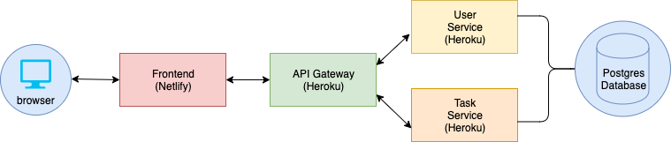

# User Task Management App

Manage Tasks and Users easily



# Tech Stack

| Frontend | Backend |
| :--------: | :-------: |
| [Vuejs](https://vuejs.org/) | [Express](http://expressjs.com/) |
| [Vuetify](https://vuetifyjs.com/) | [Postgres](https://www.postgresql.org/) |
|          | [Sequelize](https://sequelize.org/) |
|          | [HTTP Proxy Middleware](https://github.com/chimurai/http-proxy-middleware)
| [Nodejs](https://nodejs.org/) | [Nodejs](https://nodejs.org/)

# Key Takeaway

- Centralized notification system. To show a notification, you only have to dispatch an action. You don't have to worry about what makes up the service. This also makes it easy to change how notifications are shown.
- Realtime updates on the frontend whenever an action is performed.
- Reusable delete alert component.
- The microservice uses an api gateway to proxy requests to other service.
- Docker and docker-compose is integrated to allow fast onboarding in the development environment.

# Installing 

## Docker - Recommended

> Ensure you have [Docker](https://www.docker.com/products/docker-desktop) and [Docker-compose](https://docs.docker.com/compose/install/) already installed on your computer.

- Run `git clone https://github.com/adesege/user-task-manager.git` to clone the repository and `cd user-task-manager`.
- Clone and rename each `.env-sample` files in `./.env-sample`, `./services/<service name>/.env-sample` and `./client/.env-sample` to `.env`. Fill in the values appropriately.
- Run `docker-compose up` to start and build the services for the first time. To start and build the services subsequent times, run `docker-compose up --build`
- Once all the containers are up and running, run `docker-compose run <service name>-service yarn migrate:up` to run migrations. E.g. `docker-compose run users-service yarn migrate:up`
- Visit `http://localhost:3000` to access the frontend.

## Manual

> Ensure you have `nodejs` and `postgres` installed on your computer before following the steps below

- Run `git clone https://github.com/adesege/user-task-manager.git` to clone the repository and `cd user-task-manager`.
- Install yarn globally on your computer by running `npm install -g yarn`
- Install all the dependencies in the project by running `bash ./scripts/build.sh` from the root directory in your terminal.
- Clone and rename each `.env-sample` files in `./.env-sample`, `./services/<service name>/.env-sample` and `./client/.env-sample` to `.env`. Fill in the values appropriately.
- Start the service by running `./scripts/services.sh`
- Start the client by running `cd client && yarn serve` from the root directory.
- Visit `http://localhost:3000` to access the frontend.

# Contributing

> This project has been built in a way that makes extending it easy. To add a new service, 

- Create a folder for the service in `./services`.
- Ensure there is a `dev` script in the `package.json` to run the application in development environment.
- Ensure you add the route to `./services/gateway/src/server.js` to allow proxying of request.

# Deploying

## Heroku

> Heroku requires that for a nodejs application, the `package*.json` or `yarn.lock` must be in the root directory. However, because this application is a monorepo with no `package*.json` in the root directory, we need to use a buildpack to deploy each service to  Heroku.
> 
> The steps below outlines how to deploy this application on Heroku.

> Create an account on [Heroku](https://heroku.com) if you haven't done so. Also ensure you have the [Heroku-cli](https://devcenter.heroku.com/articles/heroku-cli) installed on your computer.

You will need to run the following command for each services in `./services`  and `./client` directories.

```bash
$ heroku create <service/app name>
#You can skip this step if you have already create the site on Heroku.

$ heroku buildpacks:clear -a <app name>
#Optional

$ heroku buildpacks:set https://github.com/timanovsky/subdir-heroku-buildpack -a <app name>
# This buildpack copies the files in ${PROJECT_PATH} and puts them in the root directory so that Heroku can build the project normally.

$ heroku buildpacks:add heroku/nodejs -a <app name>
# or whatever buildpack the service is using.

$ heroku config:set PROJECT_PATH=<path/to/project>
# Path to where the service is located. E.g. PROJECT_PATH=services/gateway

$ heroku git:remote -a <app name>
# This command will add the heroku git url as a remote ref to this project. You will have to run this command everytime you want to deploy to any of the services.

$ git push origin master
# To deploy the service to Heroku.
```

## Netlify

To deploy the frontend with Netlify;
- Create an account or login to your account on Netlify.
- Connect Github with Netlify and choose the repository you want to deploy from.
- Once the application has been successfully deployed, visit the auto-generated url to access the frontend.

# Author

Temitayo Fadojutimi ([@adesege](https://twitter.com/adesege_))
